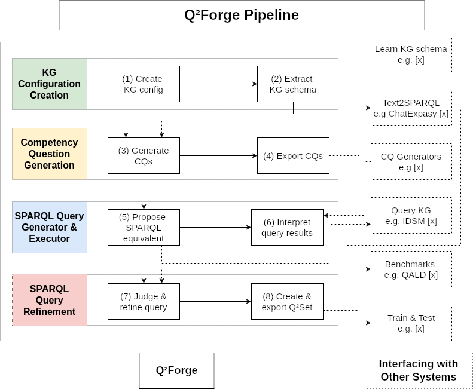

# Q²Forge

This project provides an end-to-end pipeline to generate a dataset of (question, SPARQL query) pairs for a given Knowledge Graph (KG). The backend (Gen²KGBot) can be found at [this repo](https://github.com/Wimmics/gen2kgbot).


## Features 

It provides the following feature:
- KG Configuration and Pre-processing ([read more](./doc/kg-creation.md)).
- Competency question generator ([read more](./doc/competency-question-generation.md)).
- SPARQL query generator ([read more](./doc/sparql-query-generation.md)).
- SPARQL query refinement ([read more](./doc/sparql-query-refinement.md)).

The following diagram shows the pipeline and how Q²Forge integrates with other systems




## Run locally

To run locally you need to:

1) **Install the dependencies**: run the command:

```bash
npm run i
```

2) **Start a local development server**: run the command:

```bash
ng serve
```
3) **Visualise the result**: once the server is running, open your browser and navigate to <http://localhost:4200/>.


## Build & Deploy

To build the project run the command:

```bash
npm run dc
```

This will run the following command:
```bash
ng build --base-href=/q2forge/ --deploy-url=/q2forge/ --configuration=production
```

which will compile the project and store the build artifacts in the `dist/q2forge` directory.

## License

See the [LICENSE file](./LICENSE).

## Cite this work

Yousouf TAGHZOUTI, Franck MICHEL, Tao JIANG, Louis-Félix NOTHIAS, Fabien GANDON (2025). **Q²Forge**. <https://github.com/Wimmics/q2forge> 


<details>
<summary>See BibTex</summary>
@software{taghzouti_q2forge:2025,
    author = {TAGHZOUTI, Yousouf and MICHEL, Franck and JIANG, Tao and NOTHIAS, Louis-Félix , and GANDON Fabien},
    title = {{Q²Forge}},
    url = {https://github.com/Wimmics/q2forge},
    version = {1.0.0},
    year = {2025}
}
</details>