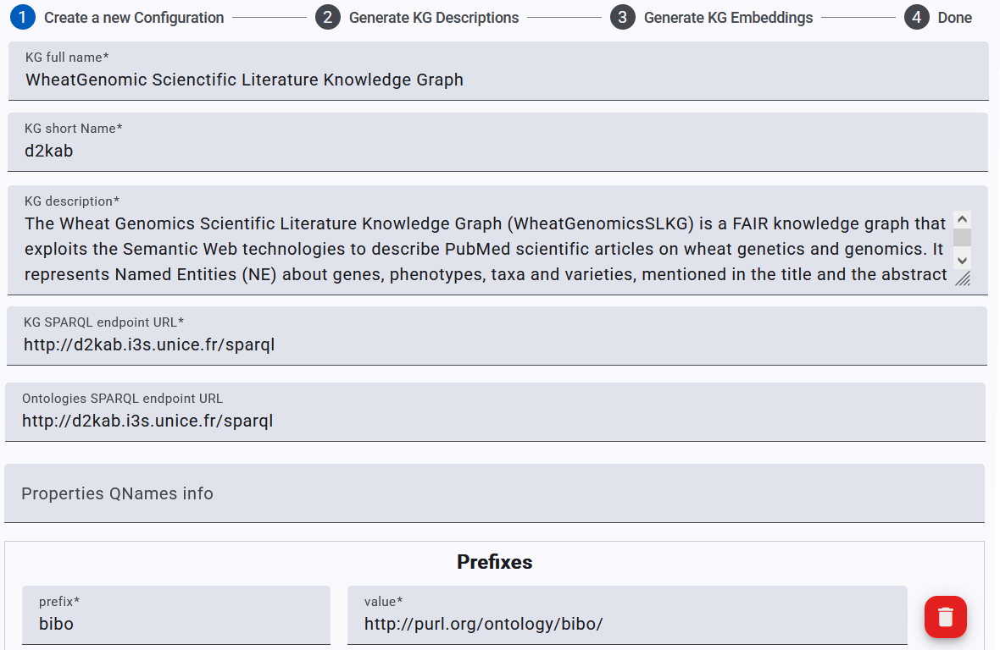

### KG Configuration and Pre-processing

#### Create a KG configuration

The pipeline starts with creating a KG configuration (depicted in the following figure) where the user provides minimal information about the target KG: a name, a short name used later on as an identifier, a textual description, a SPARQL endpoint URL, and the namespaces and prefixes to be used in the SPARQL queries and Turtle descriptions.
Optionally, the user may fill in the URL of a SPARQL endpoint hosting the ontologies in case they are not on the same endpoint as the KG itself.

